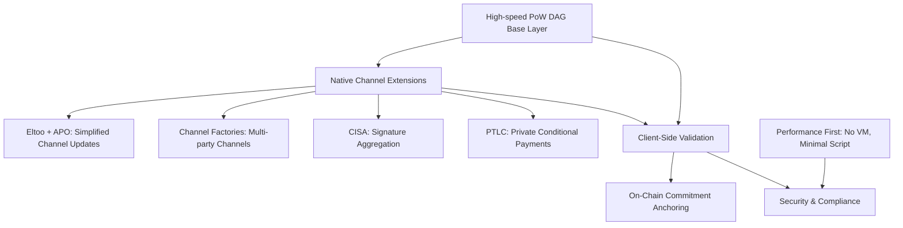

## Background and Historical Context

In the Bitcoin community, how to expand Layer 2 has always been a long-term core issue.

### Lightning Network Limitations

Lightning Network (LN), proposed in 2015, has long been regarded as Bitcoin's primary scaling solution. However, in practice, it gradually exposed multiple problems:

- Complex channel fund management
- Unstable routing
- Difficult offline arbitration
- Poor user experience

These issues resulted in limited global adoption.

### RGB Protocol Challenges

The RGB protocol (since 2018) attempted to extend Bitcoin's asset and contract layer through client-side validation + Taproot commitments. Avato Labs has been deeply involved in RGB's R&D and productization over the past two years. In version v0.12, RGB is already mainnet-ready, and we have accumulated full implementation experience in wallets, stash management, and contract execution.

However, RGB encountered two major challenges in promotion:

1. **Excessive complexity** — State synchronization, stash management, and client proof systems are extremely large, raising the threshold and hindering mass adoption.

2. **Centralization dependence** — Although theoretically client-validated, in practice the ecosystem often relies on indexers and relay nodes, deviating from the original spirit of decentralization.

### Bitcoin Core Proposals

At the same time, Bitcoin Core developers have proposed multiple BIPs in recent years, but due to conservatism in security and consensus, they have yet to be adopted into Bitcoin mainnet:

- **ANYPREVOUT (APO)**: Core proposal simplifying channel updates, enabling the Eltoo protocol
- **CISA**: Cross-input Schnorr signature aggregation, significantly reducing transaction size
- **CTV (CheckTemplateVerify)**: Covenant-based transaction template verification primitive
- **PTLC**: Privacy-enhanced conditional payment replacing HTLC

These proposals have stagnated on the Bitcoin main chain, but their engineering and economic value is undeniable.

## An Alternative to RGB + Lightning

Tondi, based on this reality and Avato Labs' long-term R&D in RGB, opens a new path: by combining a high-speed PoW DAG public chain + native channels and aggregated signatures, it forms a more efficient, simpler alternative to RGB + Lightning.

### Strategic Architecture

### Strategic Goal

Tondi's strategic goal is to use the high-speed PoW DAG public chain as the backbone, combined with native Layer 2 channel extensions and privacy protocols, to build a new path directly replacing RGB + Lightning:

- **RGB's asset extension functions** → handled by Tondi's covenant primitives (CTV, Vault) and the FUN20 standard
- **Lightning's payment channel functions** → provided by Tondi's native support for APO + Eltoo + Channel Factories + CISA + PTLC

This means:
👉 **Tondi is not "compatible with RGB+LN," but rather provides a more natural, more efficient, more decentralized alternative architecture.**

## Technical Design Principles

### Core Philosophy

> "The simpler the on-chain layer, the stronger the channels, and the more reliable the scalability and privacy."

### 1. High-Speed Settlement Layer

- **Consensus**: Based on GHOSTDAG, throughput performance is 1–2× Kaspa
- **Hashing**: Uses Blake3, throughput far beyond SHA256
- **TPS**: Peak 15,000–25,000, confirmation latency 1–2 seconds
- **Model**: Maintains stateless UTXO structure, avoiding global account bloat

### 2. Native Channels and Aggregated Signatures (Channels First)

- **ANYPREVOUT (APO)**: Simplifies channel update logic, foundation of Eltoo
- **Channel Factories**: Support multi-party batch channels, reducing on-chain footprint
- **CISA**: Cross-input Schnorr aggregation, reducing transaction size by 30–50%
- **PTLC**: Enhances privacy and conditional payment capability

👉 Combined, these modules form a native Layer 2 system that can replace RGB+Lightning, without relying on complex client state synchronization and centralized relays.

### 3. Performance First, Security Minimalism

- No general-purpose VM, only Taproot-compatible script paths and covenant primitives (CTV, Vault, etc.)
- Client-side validation first: All channel and L2 protocol execution is wallet-side, only commitments submitted on-chain
- Hardware friendly: Resource efficiency and privacy superior to Solana, extremely low operating threshold

## Technical Insights

### RGB Pain Points → Tondi's Solutions

- **RGB requires complex stash synchronization** → Tondi's Eltoo + APO directly resolves state update conflicts
- **RGB heavily depends on indexers/relays** → Tondi's Channel Factories essentially "trustlessly decentralize" channel expansion
- **RGB script limitations** → Tondi provides more intuitive security models via CTV, Vault, PTLC

### Lightning Pain Points → Tondi's Solutions

- **LN's HTLCs expose payment paths** → Tondi's PTLC hides conditions, enhancing privacy
- **LN routing efficiency is low** → Tondi's channel factories + CISA aggregation improve liquidity and throughput
- **LN's UX is poor** → Tondi's APO+Eltoo simplify channel updates, avoiding frequent on-chain arbitration

## Application Scenarios

- **Stablecoin settlement networks**: Low fees, high privacy, FATF-compliant interfaces
- **High-frequency trading & micropayments**: ≥20 bps, 15,000–25,000 TPS, suitable for DeFi matching & content payments
- **BTC Layer 2 state anchoring**: Optimal anchor for RGB & Taproot Assets
- **Compliant privacy payments**: Selective viewing & zero-knowledge auditing, serving banks and regulators
- **Rollup & state channel data layer**: More efficient fallback for ETH/BTC L2
