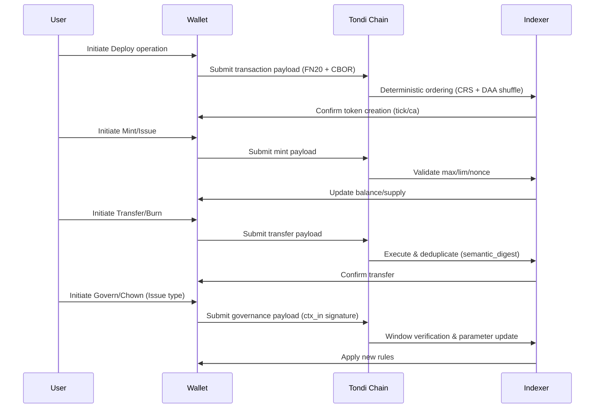

## Positioning

FUN20 is an inscription-style token protocol designed for Tondi: embedding the minimal necessary logic into transaction payloads, with determinism, compactness, extensibility, and interoperability as its core principles. It serves stablecoins, enterprise assets, and DeFi liquidity scenarios. It borrows simplicity from BRC-20/Runes but is comprehensively enhanced in deterministic execution in a DAG environment, MEV resistance, governance, and cross-chain/zk extensions.

## Design Highlights

### Operation Flow

### Key Features

1. **Ultra-compact payloads** (per operation upper limits):
   - Transfer/Burn/Mint ≤ 64B
   - Issue/Govern ≤ 96B
   - Deploy ≤ 128B
   - Target: significantly reduce bandwidth and cost in high-throughput DAG environments

2. **Deterministic replay + MEV resistance**:
   - Adopts CRS (Canonical Resolution Spec) for deterministic event ordering (DAA score → txid → input order → payload order → digest)
   - Uses DAA-seeded random shuffle to resist frontrunning

3. **Strict secure encoding**:
   - Header "FN20"+version fixed
   - Deterministic CBOR (only unsigned integer keys, strictly ascending, no indefinite length, no duplicate keys, shortest integer encoding)
   - UTF-8/NFC normalization
   - Homoglyph interception
   - Core parsers require formal verification (TLA+/Coq)

4. **Dual deployment models** (two token types):
   - **Deploy-Mint**: Open minting, globally unique by tick, supports per-mint limit lim and optional preallocation pre
   - **Deploy-Issue**: Issuer-managed, identified by contract address (CA), supporting continuous issuance, blacklist, ownership transfer chown, and lightweight governance govern

5. **Ecosystem expansion readiness**:
   - Reserved fields for zk/bridge (l1_root/proof_*, reserved lock/release/evm_call operations)
   - For integration with EVM/zkRollup/DA

## Wire Format and Encoding

- **Header**: "FN20" + 1-byte version=0x01 → followed by deterministic CBOR payload
- **Array/map dual forms**: Support fixed-order arrays to further reduce size by 20–30%
- **Semantics normalized** to map form, duplicates prevented via semantic_digest
- **Address**: Raw binary 20/32B (auto/prefix type indicator), unified derivation of addr_ns as index key

## Operation Set (op)

### Core Operations

- **deploy**: Create token (Mint: tick/max/lim/dec; Issue: name/ca/max/dec, CA deterministically derived from deployment data)
- **mint / issue**: Open minting or issuer issuance (rate-limited by max/lim and policies)
- **transfer / burn**: Transfer and burn
- **blacklist (Issue)**: Policy-layer blacklist (consensus record + client/indexer execution)
- **chown (Issue)**: Ownership/issuance right transfer (supports transfer of issuance rights only)
- **govern (Issue)**: Lightweight governance, updates parameters (max/dec/metadata) via window/quorum voting

### Permission and Nonce Management

Operations requiring permission changes bind via ctx_in signature input; nonce monotonically increases by (addr_ns, tick|ca), tolerant of DAG reordering.

## Limits and Policies

### Hard Caps

- Per-operation size caps as above
- ≤16 FUN20 payloads per tx
- ≤2000 payloads per DAA epoch (anti-spam)

### Numbers & Text

- Big-int shortest big-endian
- tick length 3–8, [a–z0–9]
- dec 0–18

### Anti-abuse Recommendations (non-consensus)

- Suggest ≤4 payloads per tx
- ≤64 per address per 60s
- Dust auto-aggregation/fee conversion

## Wallet & Indexer Expectations

### Wallets

- Deterministic encoding
- Local pre-checks (max/lim/dec/nonce/balance)
- Return standard error codes
- Display governance proposals/votes
- Prefer array encoding

### Indexers

- Support array/map
- Implement CRS+shuffle
- Provide /balance /supply /ops /owners /blacklist /govern /next-nonce standard APIs

## Security & Compliance

- Domain-separated digests (event/semantic/batch root) + explicit error codes
- Chain isolation (chain field) + expiry/replay protection (nonce/expiry)
- Selective disclosure/view keys for metadata
- Compliance audit & enterprise-ready

## Activation & Milestones

### Frontier Testnet

- Rust/Go/TS SDK + extended test vectors
- Indexer API alignment + external audit

### Mainnet Sync Activation (v2026a)

- Launched only after consistency/formal/security audit & governance approval
