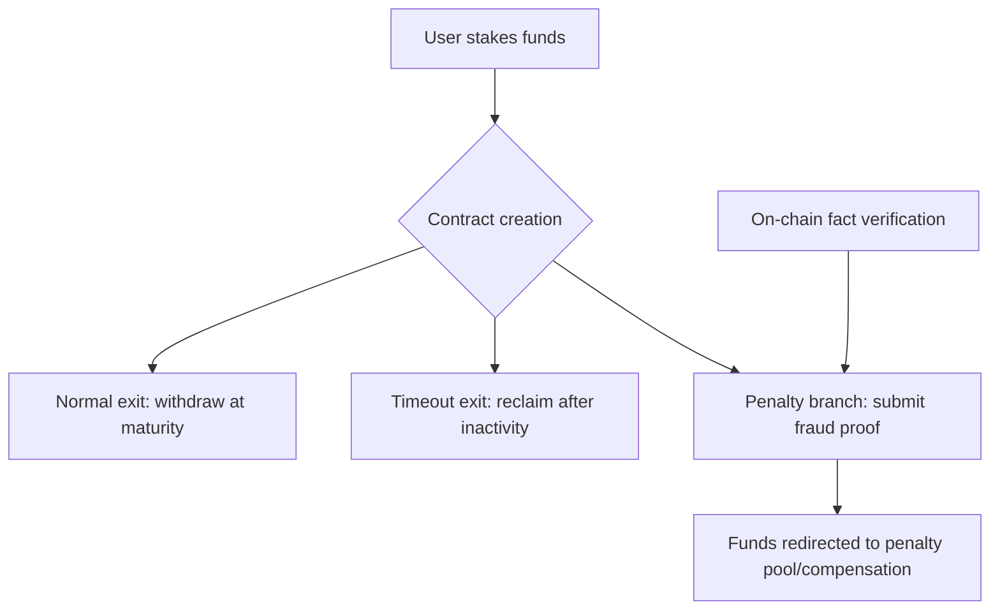

## Design Intent

Tondi remains rooted in **PoW proof-of-work**, the strongest security foundation. On top of this, we add **Conditional Staking**, a mechanism to constrain and incentivize honest participation in specific scenarios. Thus, PoW ensures chain security and decentralization, while staking provides "bonds" and "verifiable penalties" for key behaviors.

This is not meant to replace PoW's primacy, but to expand governance possibilities without sacrificing decentralization.

## Conditional Staking Mechanism

### Three-Way Exit Staking Contract

Conditional staking relies on Taproot extension scripts and simple covenant primitives, e.g., via CTV or equivalents, creating a three-way exit staking contract:

1. **Normal exit**: Safe withdrawal after agreed maturity
2. **Timeout exit**: Reclaim after prolonged inactivity  
3. **Penalty branch**: Upon submission of verifiable fraud evidence, funds redirected to penalty pool or victim

### Emphasis on Verifiability

**Verifiability** — only on-chain provable facts (e.g., double-signing, conflicting tx) can trigger penalties, avoiding human arbitration.

## New Governance Possibilities

With conditional staking, Tondi can support governance scenarios hard to automate on traditional PoW chains:

### Infrastructure Guarantees
- **Relay/observer/channel hubs** stake to guarantee service
- **Malicious/violating behavior** penalized via proofs

### Cross-chain & Channel Safety
- In **Eltoo/channel factories**, attempts to submit outdated states can be penalized
- **Removes need for arbitrators** through automated penalty mechanisms

### Parametric Governance
- **Protocol parameters** (e.g., fee caps, bandwidth allocation) can be modified via staked proposals
- **Abuse punished** by stake slashing

### Accountable Governance
- **Staking makes "commitment with cost" possible** — governance becomes binding, not costless signaling
- **Community accountability** through economic incentives

## Philosophical Insight

> PoW should not be replaced, but neither must it be isolated. With conditional staking, Tondi does not alter PoW's core but adds a flexible governance texture atop its hardened shell.

### Core Principles

1. **PoW Primacy**: Hashpower remains the primary security mechanism
2. **Governance Enhancement**: Staking adds governance capabilities without compromising decentralization
3. **Economic Incentives**: Binding commitments through economic stakes
4. **Automated Enforcement**: On-chain verifiable facts trigger penalties

### Benefits

- **Network Security**: Maintains PoW's proven security model
- **Sustainable Evolution**: Community accountability through economic incentives
- **Flexible Governance**: Supports complex governance scenarios
- **Decentralization**: No central authority required for governance decisions

## Implementation Strategy

### Phase 1: Foundation
- Implement basic conditional staking contracts
- Deploy Taproot-based covenant primitives
- Establish penalty mechanisms

### Phase 2: Governance Expansion
- Enable parametric governance through staked proposals
- Implement infrastructure guarantees
- Deploy cross-chain safety mechanisms

### Phase 3: Advanced Features
- Complex governance scenarios
- Automated penalty enforcement
- Community-driven parameter updates

## Security Considerations

### Fraud Proof Requirements
- **On-chain verification**: All penalties must be verifiable on-chain
- **No human arbitration**: Automated enforcement based on cryptographic proofs
- **Economic incentives**: Sufficient stake to deter malicious behavior

### Decentralization Maintenance
- **No central authority**: All governance decisions through decentralized mechanisms
- **Community participation**: Broad participation in governance processes
- **Transparent processes**: All governance actions publicly verifiable
