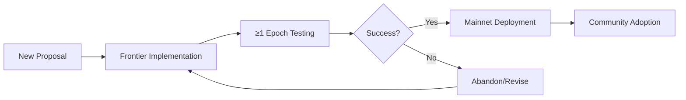

## Background & Issue

### Blockchain's Paradox

Blockchain faces a fundamental paradox: **too fast risks errors, too slow risks stagnation**. 

- **Bitcoin's conservatism** makes it robust but stalls many proposals
- **Other chains' aggressive upgrades** bring compatibility and security risks

Tondi seeks balance through a **biannual evolution cadence** and a **permanent experimental network** — Tondi Frontier.

## Biannual Rhythm

### Version Cadence

- **Version cadence** defined by DAA score (difficulty adjustment metric), not rigid block heights
- **Every 6 months** = a new evolution epoch
- **Mainnet upgrades** possible at epoch boundaries
- **Minor updates** can be governed mid-epoch
- **Predictability** without rigidity

### Benefits

- **Predictable Schedule**: Community knows when to expect major changes
- **Flexible Timing**: DAA-based timing adapts to network conditions
- **Governance Integration**: Minor updates can be handled through governance
- **Risk Management**: Controlled upgrade cycles reduce unexpected disruptions

## Role of Tondi Frontier

### Permanent Experimental Chain

Frontier is not a one-off testnet, but a **never-reset experimental chain**:

- **All features** must run ≥1 epoch on Frontier before mainnet
- **Frontier adopts** Kaspa improvements, Bitcoin proposals, Tondi's own experiments first
- **Frontier has low incentives** → reduced risk
- **Frontier stays structurally compatible** with mainnet → easy migration/cross-validation

### Experimental Process

### Benefits

- **Risk Isolation**: Experimental features tested without mainnet risk
- **Continuous Innovation**: Always testing new ideas
- **Easy Migration**: Structural compatibility enables smooth transitions
- **Community Feedback**: Real-world testing with reduced stakes

## Risks & Restraint

### Healthy Abandonment

**Not all innovations will enter mainnet.** Some may be abandoned after Frontier testing. This is healthy:

- **Mainnet stays conservative** - only proven features
- **Frontier stays bold** - continuous experimentation
- **Risk is isolated** - failed experiments don't affect mainnet
- **Evolution continuous** - constant innovation and improvement

### Risk Management

- **Experimental Features**: Tested extensively before mainnet deployment
- **Community Input**: Community feedback shapes feature development
- **Technical Validation**: Technical merit determines mainnet inclusion
- **Economic Considerations**: Economic impact evaluated before deployment

## Implementation Strategy

### Phase 1: Foundation
- Establish biannual upgrade schedule
- Deploy Tondi Frontier experimental network
- Implement governance mechanisms for upgrades

### Phase 2: Community Integration
- Community-driven proposal process
- Technical evaluation committees
- Economic impact assessment

### Phase 3: Advanced Features
- Complex upgrade mechanisms
- Cross-chain compatibility testing
- Advanced governance features

## Benefits of This Approach

### For Developers
- **Predictable Environment**: Know when major changes will occur
- **Experimental Freedom**: Test new ideas on Frontier
- **Community Feedback**: Get feedback before mainnet deployment

### For Users
- **Stability**: Mainnet remains stable and reliable
- **Innovation**: Continuous innovation through Frontier
- **Transparency**: Clear upgrade process and timeline

### For the Ecosystem
- **Balanced Evolution**: Neither too conservative nor too aggressive
- **Risk Management**: Isolated risk through experimental network
- **Community Participation**: Community-driven development process

## Governance Integration

### Upgrade Decision Process

1. **Proposal Submission**: Community submits upgrade proposals
2. **Technical Review**: Technical committee evaluates proposals
3. **Frontier Testing**: Features tested on Frontier for ≥1 epoch
4. **Community Vote**: Community votes on mainnet deployment
5. **Implementation**: Successful features deployed to mainnet

### Community Participation

- **Proposal Rights**: Community can submit upgrade proposals
- **Voting Power**: Community votes on major upgrades
- **Technical Input**: Technical community provides evaluation
- **Economic Analysis**: Economic impact assessed before deployment
